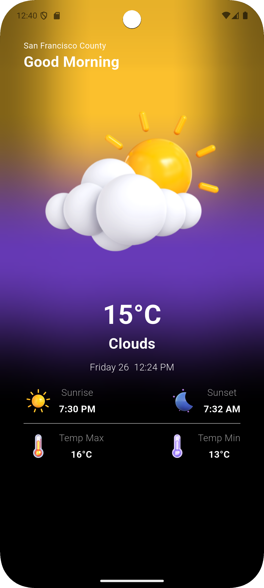

# 🌤️ Weather App

A simple Flutter weather application that fetches **real-time weather data** based on the user’s location.  
Built with **BLoC state management** and **OpenWeather API** integration.

---

## 🚀 Features
- 🌎 Get weather data for your current location
- 🌡️ Displays temperature (°C), min/max values, sunrise & sunset
- 🎨 Beautiful UI with gradient & blur effects
- 📱 Built using **flutter_bloc** and **geolocator**

---

## 🛠️ Tech Stack
- **State Management:** flutter_bloc
- **API Integration:** http + weather
- **Location Services:** geolocator
- **Environment Variables:** flutter_dotenv
- **Date & Time Formatting:** intl

---

## 📸 Screenshot
